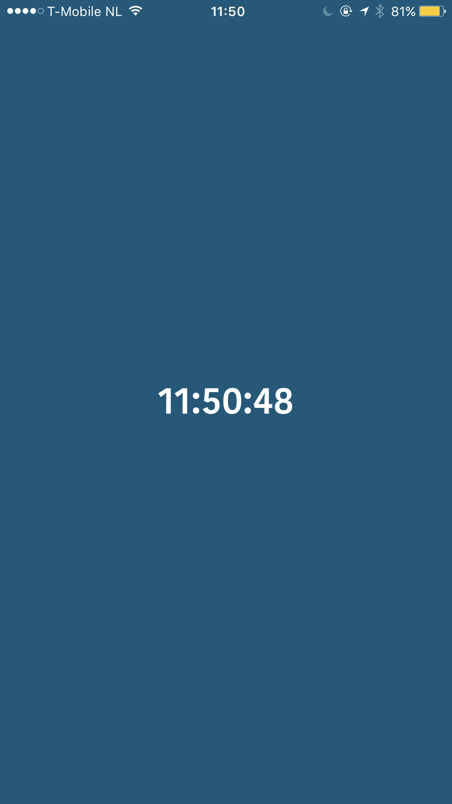

This project was bootstrapped with [Create React Native App](https://github.com/react-community/create-react-native-app).

# React Native Clock

Toy project just to experiment [Create React Native App](https://github.com/react-community/create-react-native-app) and [Styled Components 💅](https://github.com/styled-components/styled-components)

<center>
  
</center>

### Quick Start

```
npm install
npm start
```
